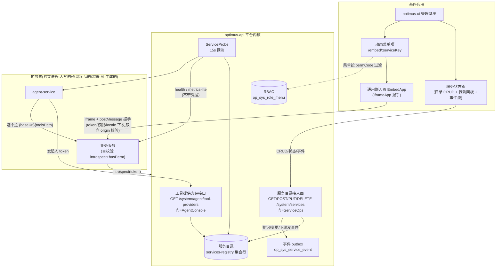
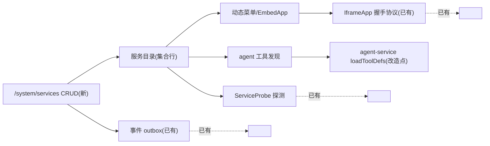

# Design: service-registry

## 1. 架构图

一句话读法:**目录是唯一事实源**——探测、菜单、工具三个消费者读同一份数据;
写入只有一个门(ServiceOps),变更只有一种痕(outbox 事件)。

## 2. 数据模型

**存储零新表**。目录 = services-registry 集合行(form 协议 schema,加字段零迁移):

| 字段 | 类型 | 必填 | 说明 |
|---|---|---|---|
| name | text | 是 | 服务显示名 |
| baseUrl | text | 是 | 基础地址(探测/工具的根) |
| healthPath | text | 否 | 默认 /health;注意 optimus-api 全局前缀是 /api/health |
| metricsPath | text | 否 | 如 /metrics-lite,空则卡片无指标 |
| enabled | switch | 否 | 总开关:关=不探测、不进菜单、不供工具 |
| entryType | select(none/embed) | 否 | 入口形态;zone 为将来预留 option,本期不加 |
| embedUrl | text | entryType=embed 时必填 | iframe 入口地址,变更需二次确认 |
| menuTitle / menuIcon | text | 否 | 菜单标题与 antd 图标名(默认 AppstoreOutlined) |
| permCode | text | 否 | 访问权限码;空=仅 ServiceOps 可见(缺省从紧) |
| toolsPath | text | 否 | Agent 工具声明端点,如 /system/agent/tools |

行 key = 服务 slug(如 demo-activity),即 /embed/:serviceKey 的 serviceKey。

**服务侧数据的决策规则**(写进接入文档):

- 数据小、结构简单、无复杂查询 → 经 API 用平台数据集合(schema 校验与管理 UI 白得)
- 有自己的领域模型/事务/性能要求 → 自己的库
- **红线:任何服务不得直连平台 MySQL,只走 HTTP API**——表结构是平台私有实现,
  直连等于把契约从 HTTP 挪进表结构,平台从此不敢改表
- 会话与身份一概不存:token 透传 + introspect

## 3. 权限模型

单层 RBAC 一条链,不新建权限系统:`用户 → 角色 → 权限码 → 守卫/introspect`。

| 权限类 | 码 | 管什么 | 执行位置 |
|---|---|---|---|
| 治理权 | ServiceOps(68/69,已有) | 面板/事件流读 + 目录写 | 平台 @Perm 守卫 |
| 服务业务权 | 各服务自报(如 ActivityAdmin) | 该服务的 API 谁能调 | **服务自己** introspect+hasPerm |
| 入口可见权 | 同上一行的码 | 动态菜单项对谁显示、/embed/:key 放谁进 | 基座过滤(UX 层,非安全边界) |

- 读写不拆两个码:规模不到;出现"只能看不能改"的真实角色再拆(改一处装饰器)
- permCode 生命周期:目录声明 → 权限管理建码分配角色 → 三处消费。
  登记表单检测码是否已建,未建给提示;**不自动建码**——写权限表不被登记动作旁路触发
- 纪律:基座的菜单过滤与 /embed 拦截只是体验,**服务永远自己校验**。
  拿掉基座 UI 也不存在越权面,这是"拿不到就不算有"的权限观

## 4. 依赖关系

改造点只有三个,其余全是既有件:

1. **新增** service-ops 模块内的目录 CRUD(读写 services-registry 行 + 发事件 + embedUrl 校验)
2. **新增** 前端:服务状态页登记表单、动态菜单注入(照抄 getDynamicDocumentMenus 模式)、
   /embed/:serviceKey 通用嵌入页(包 IframeApp)
3. **改造** agent-service loadToolDefs:PROVIDER_URLS 从 env 改为调
   GET /system/agent/tool-providers(带发起人 token);env 保留作 fallback,
   目录接口打不通时退回静态配置,agent 不因目录故障失能

spike 结论(已验证):动态菜单注入有现成同构先例——动态文档菜单
(getFullMenuConfig 把接口数据注入菜单树,节点指向固定参数化路由 /edit-doc/:id),
iframe 入口照此走 /embed/:serviceKey,不需要动态注册组件。

## 5. 安全设计

| 威胁 | 缓解 |
|---|---|
| 登记恶意 baseUrl 令探测器打内网(SSRF) | 登记过 ServiceOps 门;探测请求**不带任何凭据**,响应只取状态与指标摘要;baseUrl 仅允许 http(s) 且禁带用户信息段 |
| embedUrl 指向恶意页骗握手 token(最大风险) | IframeApp 已双向 origin 校验,token 只发给登记 origin;embedUrl 新增/变更前端二次确认 + 事件留痕;登记 embedUrl 是管理员授信动作,信任级别等同改代码上线 |
| 绕过基座直调服务 API | 无所谓:服务自己 introspect+hasPerm,基座 UI 不是安全边界 |
| 工具 provider 返回恶意 path | 沿用 agent-tool-protocol 既有防御:path 只允许相对路径、base 钉死 |
| 目录变更无痕 | service.registered/updated/removed 事件,含操作人(服务端从 token 记) |
| AI(或任何自动化)滥用登记 | 无特殊通道:登记接口过与人相同的 ServiceOps 门,token 透传保证以发起人身份留痕 |

## 6. 未来扩展(均不在本期)

| 方向 | 目录里已留的位 | 触发条件 |
|---|---|---|
| C 端 zone 转发 | entryType 增加 zone option + pathPrefix 字段 | C 端出现第二个团队的页面 |
| service token / 心跳自注册 | 登记行加 credential 引用字段 | 出现无用户上下文的服务间调用 |
| 事件升级 NATS relay | outbox 表即 relay 源,语义不变 | 出现秒级延迟不可接受的事件消费者 |
| 读写权限拆分 | ServiceOps 拆 Read/Write 两码 | 出现"只能看不能改"的真实角色 |
| **AI 生成扩展物(最终形态)** | 登记通道已接口化、schema 机器可读;将来把登记本身注册为 agent 工具(service_register,门=ServiceOps),AI 自助登记、人审批 embedUrl 等高危字段 | agent 具备产出可部署服务的能力后,单独立项 |

AI 生成属**外来扩展**:它产出的服务与人写的服务走完全相同的登记、权限、探测、
审计通道。本迭代的职责只是把这个通道做对,不实现生成本身。
