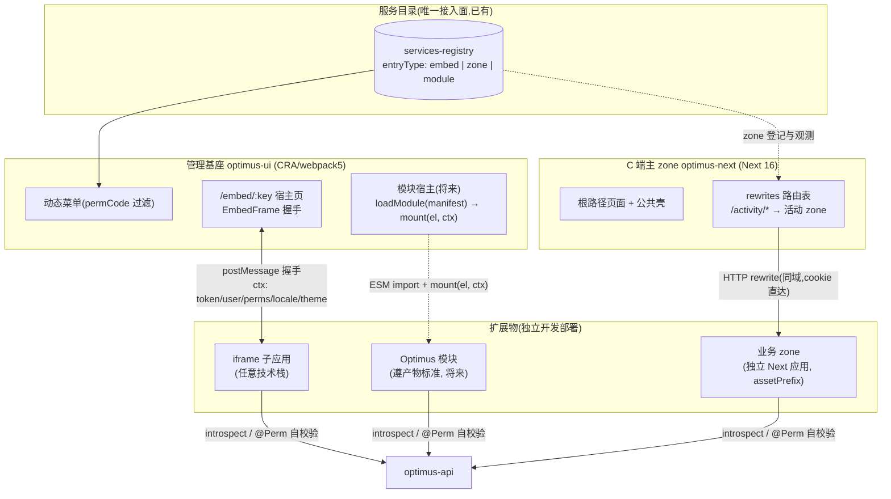

# Design: micro-frontend

## 1. 最终架构

**灵魂:通道三种,契约一份。**

- **接入面同一个**:三种模式都是服务目录一行登记(entryType 区分),
  探测、权限、审计事件白得
- **上下文契约同形**:iframe 握手 payload、zone 的 cookie 会话解出的身份、
  模块 mount 的 ctx 参数,字段完全一致——
  `{ token?, user, perms, locale, theme }`(zone 模式无需 token 字段,cookie 即凭据)
- **权限一条链**:permCode 声明在目录 → RBAC 分配 → 基座过滤入口(UX)→
  **扩展物后端自校验(安全边界)**。三种模式无一例外

## 2. 模式一:iframe(已落地,本方案只正式化定位)

现状即成品:`@optimus/admin-embed`(子应用侧,零构建 UMD)+ EmbedFrame(基座侧)
+ 服务目录 entryType=embed + `/embed/:serviceKey` 宿主路由。

**定位边界**(写死,防滥用):适用于**外部团队/异构技术栈/不信任边界**的管理页。
不适用于:需要与基座共享路由或组件的场景(那是模式三)、C 端 SEO 页面(那是
模式二)。iframe 的成本是双滚动条/弹层受限/通讯窄带,这些是隔离的代价而非缺陷,
选它就是选隔离。

## 3. 模式二:Multi-Zones(本方案的落地对象)

### 机制(Next 官方,16.x 文档在维)

- 每个 zone = 一个普通 Next 应用,配 `assetPrefix` 防静态资源冲突
  (Next 15+ 连 rewrite 静态资源那条都不用写了)
- 主 zone(optimus-next)持有 rewrites 路由表,把 `/activity/*` 这类前缀
  整段转发到业务 zone 的部署地址;需要动态决策时可升级为 proxy.js
- 同 zone 内软导航,跨 zone 硬导航——**拆分边界必须是"用户很少跨着连点的
  业务域"**,这是 zone 划分的第一原则
- 跨 zone 链接用 `<a>` 不用 `<Link>`(Link 会尝试 prefetch 跨 zone 路径)
- 用 Server Actions 的 zone 要配 `serverActions.allowedOrigins`(用户见到的
  是主域,不是 zone 自己的域)

### 我们的落地设计

1. **登录态零改造**:C 端认证是同域 httpOnly cookie(平台既有形态),
   zone 经 rewrite 后同域,cookie 直达;zone 后端拿 cookie 调 introspect
   (client 分支)得身份——与其他团队后端接入是同一条路径
2. **zone 划分原则**:按业务域整段路径;跨 zone 硬导航可接受为准;
   URL 前缀全域唯一(目录登记时校验)
3. **服务目录接轨**:目录 entryType 增加 `zone`(字段:pathPrefix)。
   第一步 rewrites 仍是 next.config 静态配置(改路由表=改配置重新部署,
   zone 本来就是部署级拆分,这不是妥协);目录承担登记、探测、观测与
   "路由表的事实源"角色。将来若需要灰度/动态切流,升级 proxy.js 从目录
   读表(带缓存)——留位不实现
4. **共享一致性**:公共 UI/工具经 monorepo workspace 包共享
   (@optimus/client-sdk 已是先例);发布节奏不同步的功能用配置开关对齐
5. **观测**:zone 就是一个服务,目录登记后探测面板白得

### 拆分候选(定第一个 zone 时评估)

- 活动/营销页(`/activity/*`):生命周期短、迭代快、与主站耦合低——首选
- 博客/文档(`/blog/*`):内容型,独立发布节奏
- 主站壳(`/`、auth、profile)永远留在主 zone

## 4. 模式三:Optimus 模块标准 v0(只定标准,不实现)

### 为什么标准自有,而不是直接用 Module Federation

- **Next 侧行业缺位是事实**:nextjs-mf 官方进入弃用流程(postinstall 挂
  弃用通知,指向 module-federation/core#3153),peerDeps 止步 Next 15
  (我们是 16);MF 2.0 主战场在 webpack/rspack,Turbopack 无方案
- **我们两个基座构建器不同**(CRA/webpack5 与 Next16),绑定任何构建器
  插件都只覆盖一半——所以标准必须定在**产物契约层**:任何构建器,能吐出
  符合契约的 ESM 产物即可接入
- 呼应服务端同一判断:契约(HTTP/OpenAPI ↔ ESM/manifest)是稳定资产,
  框架/构建器是可替换实现

### 标准草案(v0,五条契约)

1. **产物**:标准 ESM(单入口 + 可选异步 chunk),不依赖任何联邦运行时;
   基座用原生 `import()` 加载
2. **manifest**(随产物发布的 JSON):
   `{ name, version, entry, styles?, sharedPeers: {react: "^19", antd: "^5"}, permCode, ctxVersion }`
   ——目录 entryType=module 的条目指向 manifest URL
3. **挂载协议**(入口模块的默认导出):
   `mount(el: HTMLElement, ctx: OptimusCtx): { unmount(): void; onCtxChange?(ctx): void }`
   ——ctx 与 iframe 握手 payload 同形,加 `basePath`(基座分配的路由前缀)
4. **共享依赖**:react/react-dom/antd 由基座提供,模块构建时 external;
   版本兼容以 sharedPeers 声明、基座加载时校验,不符拒载(启动即炸优于
   运行时玄学)
5. **隔离**:CSS 必须前缀化或 CSS Modules/shadow root(构建时保证);
   JS 不做运行时沙箱——模块是受信代码(过目录登记+code review),
   约定换魔法

### 触发条件(写死)

出现第一个"iframe 交互深度不够、又不值得拆 zone"的**真实**业务模块时,
以它为校准用例实现基座 loader + 首个模块。在那之前本标准只是文本,
不写一行加载器代码——没被真实用例打磨过的标准实现必然返工。

## 5. 依赖与改造点(Multi-Zones 落地时)

1. 目录 schema:entryType 加 `zone` option + pathPrefix 字段(form 协议零迁移)
2. optimus-next:next.config rewrites 表 + 跨 zone 链接排查(a 标签)
3. 新 zone 应用:workspace 内新包(next + assetPrefix + basePath),
   模板化为 `examples/zone-template`
4. 目录登记 + 探测(healthPath 探 zone 自身)
5. 共享包:公共样式 tokens/页头页脚组件抽 @optimus/ui-shell(拆第一个 zone 时做)

## 6. 可行性依据与风险

| 项 | 依据/缓解 |
|---|---|
| Multi-Zones 官方支持 | Next 16.x 官方指南(2026-06 更新)、with-zones 官方示例;机制仅 rewrites+assetPrefix,无私有魔法 |
| 登录态跨 zone | 同域 cookie,平台 C 端认证既有形态,零改造;实测项:zone 内 API Route 代理凭据转发 |
| 跨 zone 硬导航体验 | 划分原则约束(业务域整段);风险接受:营销/内容页对硬导航不敏感 |
| 共享 UI 漂移 | monorepo 共享包 + 发布用配置开关对齐;风险接受:zone 间小版本视觉差 |
| nextjs-mf 弃用 | npm postinstall 弃用通知实查(2026-08);不依赖它,标准定在产物层 |
| 标准无用例打磨 | 明确不实现,触发条件写死 |
| 服务目录耦合 | 目录挂掉时:iframe 入口消失(菜单拉不到)、zone 不受影响(rewrites 静态)——故障半径可控 |

## 7. 与既有体系的关系

- 服务目录:三模式的登记/权限/观测面(entryType 从 none/embed 扩为
  none/embed/zone/module,分两次落地)
- admin-embed 协议:模式一专用,同时其 payload 形状升格为跨模式的
  **OptimusCtx 契约**(单独文档化)
- 服务端微服务:zone/模块的后端仍走 introspect + @Perm 自校验,
  前端拆分不改变任何服务端边界
